# Streakify Backend

Backend MVP for the Streakify habit tracking application.

## Tech Stack
- Java
- Spring Boot
- PostgreSQL
- JPA / Hibernate
- Maven
- Postman

---

## Setup Steps

1. Clone the repository

git clone https://github.com/Augustine0077/Streakify.git

cd Streakify

2. Create PostgreSQL database

streakify_db

3. Configure database in application.properties

spring.datasource.url=jdbc:postgresql://localhost:5432/streakify_db
spring.datasource.username=postgres
spring.datasource.password=yourpassword

4. Run the application

./mvnw spring-boot:run

Server runs on:
http://localhost:8080

---

## Database Schema

Located in:

database/schema.sql

---

## API Endpoints

Users
POST /users  
GET /users/{id}  
DELETE /users/{id}

Habits
POST /habits  
GET /users/{userId}/habits  
DELETE /habits/{id}

Habit Logs
POST /habits/{habitId}/logs  
PUT /habits/{habitId}/logs/{date}  
GET /habits/{habitId}/logs

Streak
GET /habits/{habitId}/streak

Dashboard
GET /users/{userId}/dashboard

---

## Sample Request

POST /users

{
"name": "Augustine",
"email": "augustine@gmail.com"
}

---

## Postman Collection

Located in:
postman/streakify_api_collection.json

---

## Screenshots

### Create User
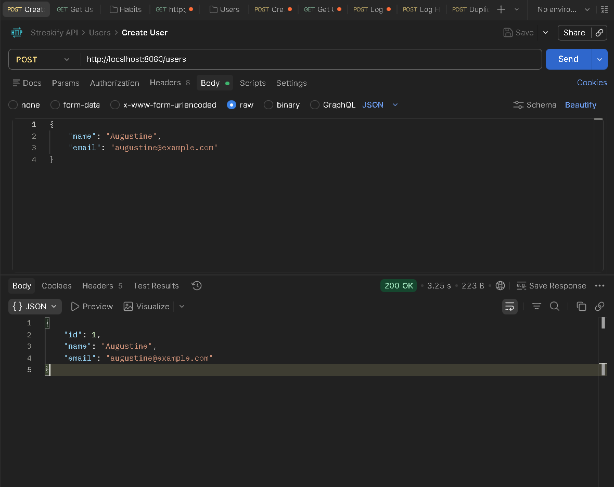

### Get User
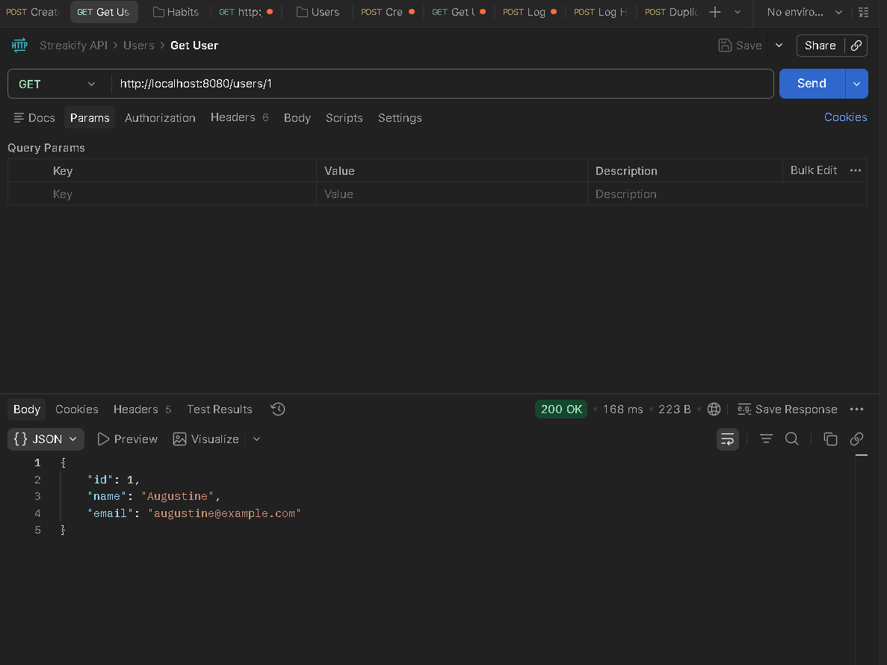

### Delete User
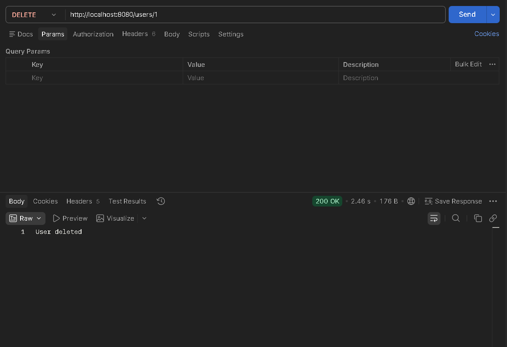

---

### Create Habit
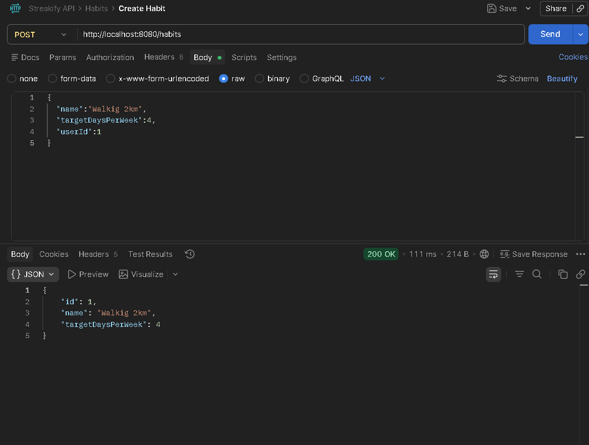

### Get User Habits
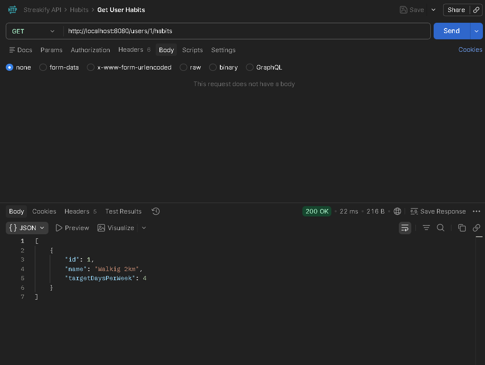

### Trying to Add Same Habit

---

### Log Multiple Days

Day 1  
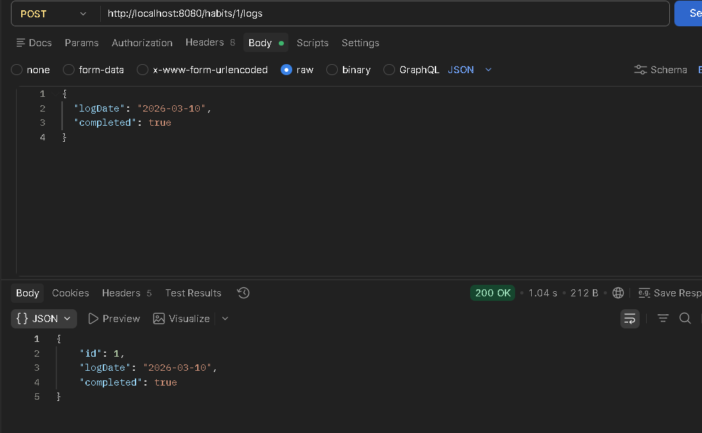

Day 2  
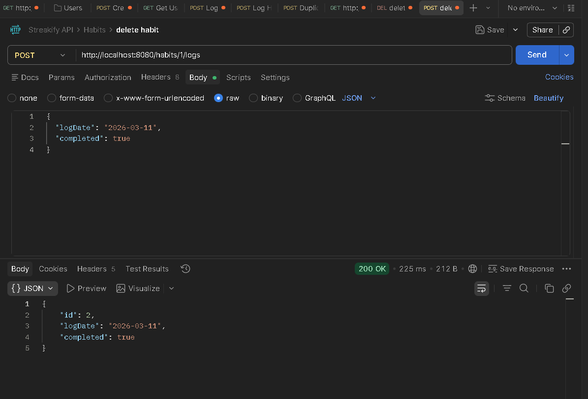

Day 3 (Faild)  
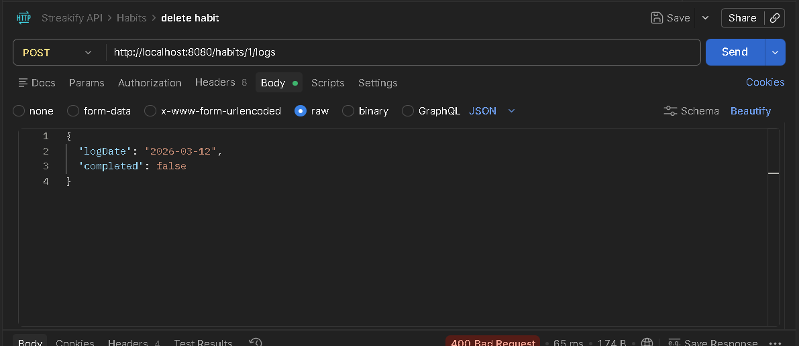

---

### Fetch Streak
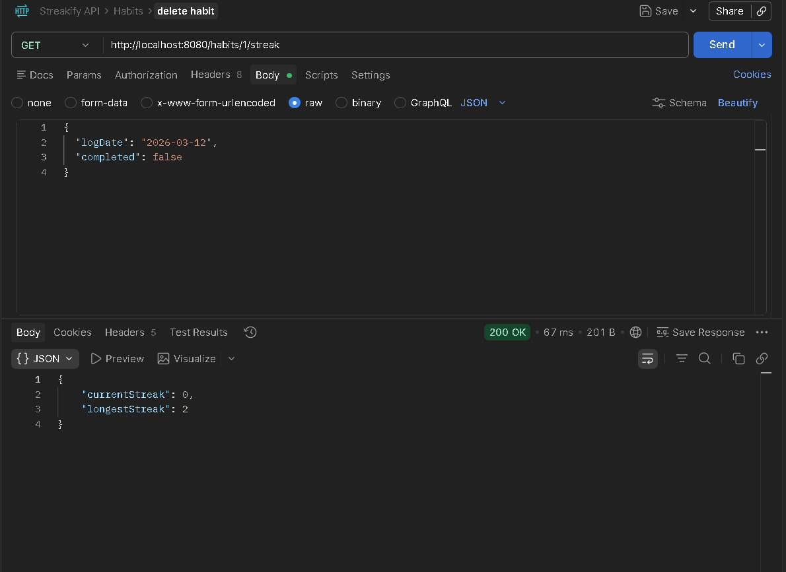

---

### Dashboard
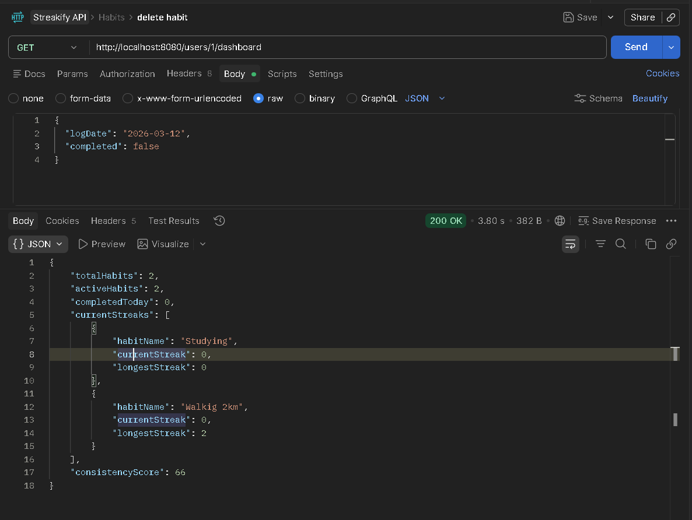

---

### Negative Cases

Duplicate Log  
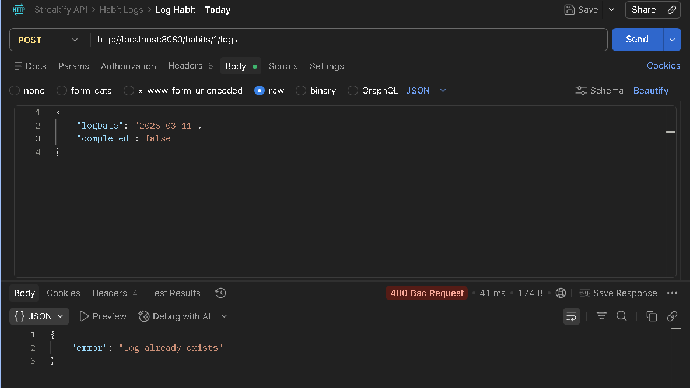

Future Date Cannot Be Added  

Non Existing User  
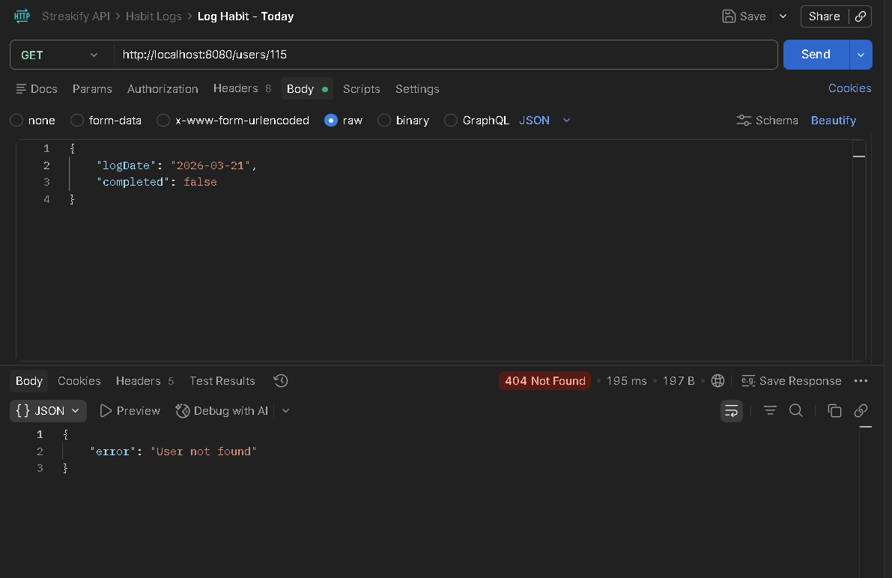